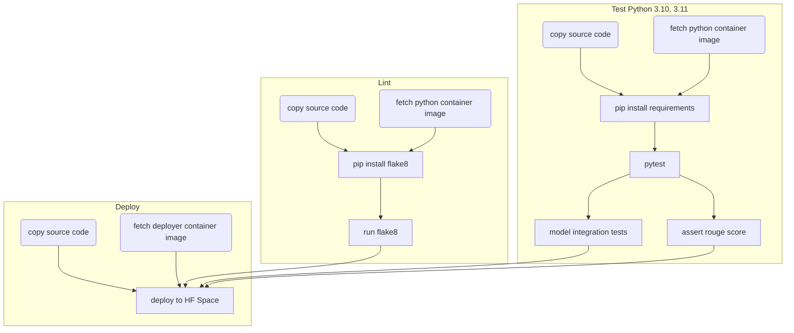

# 🤗 MLOps with Hugging Face Spaces and Dagger

## Overview

This project shows how to automate a full ML Application with build, test and deploy, using Dagger pipelines.

All pipelines are written in Python, using the [Dagger Python SDK](https://docs.dagger.io/sdk/python).

## Live demo

Here is demo recording from [the Dagger community call](https://dagger.io/events).

[](https://www.youtube.com/watch?v=CoHjpBQLp98)

## Dependencies

The project uses the following technologies:

- [Dagger](https://dagger.io/) - for the programmable pipelines
- Hugging Face Hub - for pulling the model and weights (using the Transformers library)
- Hugging Face Space - for running the Application

## How to run the pipelines

First, make sure you have the [the dagger CLI](https://docs.dagger.io/cli/465058/install) installed.

The pipeline `deploy_space.py` will run the `linter` and the `test` pipelines before deploying the code.

```sh
cd ci/
python3 -m venv .venv && source .venv/bin/activate
pip install -r requirements.txt
cd ..
dagger run python ./ci/deploy_space.py
```

It's possible to only run the linter:

```sh
dagger run python ./ci/lint.py
```

Or the model tests:

```sh
dagger run python ./ci/test.py
```

## Pipelines

The project implements three Dagger pipelines for Lint, Test and Deploy, illustrated with the following diagrams:



## Why Dagger

Applications backed by LLMs are challenging to make production ready, LLMs add constraints to build automations pipelines for building, testing and deploying applications.

Dagger provides several key features to build scalable, reproducible and portable CICD pipelines. This part outlines the benefits of Dagger in a context of an LLM-backed application.

- [Caching](https://docs.dagger.io/635927/quickstart-caching/#use-caching): Using a pre-trained models involves fetching its Parameters (1.1GB of data with the model used here), Dagger can cache the parameters so they are fetched only once from the Hugging Face Hub.
- Dagger pipelines can run locally so you don't need to rely on a CI infrastructure to develop your pipelines.
- Dagger integrates easily with Github or Gitlab.
- Dagger pipelines are computed using a [DAG](https://en.wikipedia.org/wiki/Directed_acyclic_graph) - so it will run only what is needed, and parallel whenever possible.

## Future iterations

Those are ideas that will likely be implemented in future iterations. This is open to feedback in case you want to see anything else.

- Fine-tune an existing model from Hugging Face using a new dataset and swap out the current model with the new one
- GPU access
